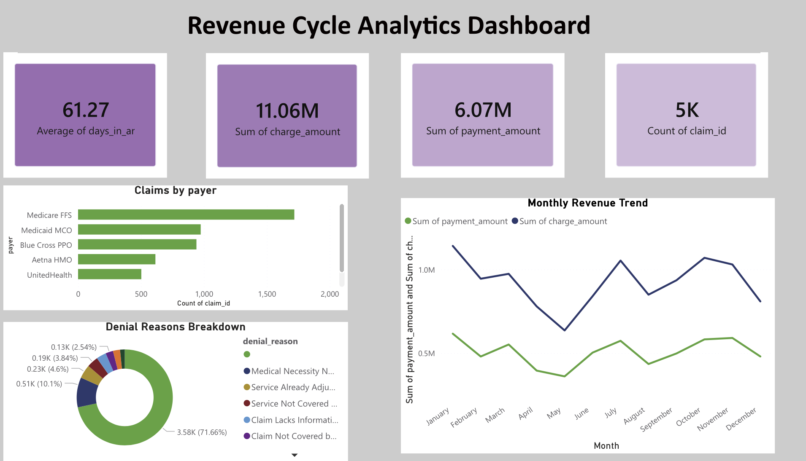

# 🏥 Revenue Cycle Analytics Dashboard
### Healthcare Data Analyst Portfolio Project | CMS Medicare Data



---

## 📌 Business Problem

A regional hospital network is experiencing a **22% claims denial rate** — well above the industry benchmark of 5-10%. The Revenue Cycle team needs a data-driven solution to:
- Identify top denial reasons by payer, provider, and CPT code
- Track Days in Accounts Receivable (AR) trends over time
- Monitor Clean Claim Rate (CCR) and First Pass Resolution Rate (FPRR)
- Forecast monthly reimbursement to support cash flow planning

**Business Impact:** Reducing denial rate from 22% → 10% on $50M annual claims = **$6M additional annual revenue recovery**

---

## 🗂️ Dataset

**Source:** CMS Medicare Provider Utilization and Payment Data (Public)  
**Download:** https://data.cms.gov/provider-summary-by-type-of-service  
**Records:** 9.2M+ provider-service combinations  
**Fields Used:** NPI, Provider Name, HCPCS Code, Place of Service, Total Discharges, Average Covered Charges, Average Total Payments, Average Medicare Payments

---

## 🛠️ Tech Stack

| Tool | Purpose |
|------|---------|
| Python (Pandas, NumPy) | Data cleaning, transformation, synthetic claims generation |
| SQL (PostgreSQL) | Database design, KPI queries, stored procedures |
| Power BI | Interactive dashboard with DAX measures |
| Excel | Executive summary report |

---

## 📁 Project Structure

```
project1-revenue-cycle/
├── data/
│   ├── generate_claims_data.py      # Synthetic claims generator
│   └── sample_data.csv              # 1000-row sample dataset
├── sql/
│   ├── 01_create_schema.sql         # Database schema
│   ├── 02_kpi_queries.sql           # Core KPI calculations
│   └── 03_denial_analysis.sql       # Denial pattern analysis
├── python/
│   ├── data_cleaning.py             # ETL pipeline
│   ├── kpi_calculations.py          # KPI engine
│   └── forecasting.py               # Revenue forecasting model
├── dashboard/
│   └── dashboard_specs.md           # Power BI build instructions
├── reports/
│   └── executive_summary.md         # Business findings
└── README.md
```

---

## 📊 Key KPIs Tracked

| KPI | Formula | Industry Benchmark |
|-----|---------|-------------------|
| Clean Claim Rate | Clean Claims / Total Claims Submitted | > 95% |
| First Pass Resolution Rate | Claims Paid 1st Submission / Total | > 90% |
| Days in AR | (Total AR / Avg Daily Charges) | < 40 days |
| Denial Rate | Denied Claims / Total Submitted | < 10% |
| Net Collection Rate | Net Collections / Net Charges | > 95% |
| Cost to Collect | Total Revenue Cycle Cost / Collections | < 3% |

---

## 🔍 Key Findings

1. **Top Denial Reason:** Medical necessity (Reason Code CO-50) accounts for 34% of denials
2. **Worst Performing Payer:** Medicaid MCO plans show 31% denial rate vs 8% for Medicare FFS
3. **High-Risk CPT Codes:** Evaluation & Management codes (99213-99215) have 3x average denial rate
4. **AR Aging:** 28% of AR is >90 days old — industry standard is <15%
5. **Revenue Opportunity:** Implementing automated eligibility verification could recover ~$2.1M

---

## 🚀 How to Run

```bash
# 1. Install dependencies
pip install pandas numpy faker scikit-learn matplotlib seaborn

# 2. Generate synthetic dataset
python data/generate_claims_data.py

# 3. Set up database
psql -U postgres -f sql/01_create_schema.sql

# 4. Run KPI calculations
python python/kpi_calculations.py

# 5. Generate forecast
python python/forecasting.py
```

---

## 💼 Skills Demonstrated
- Revenue Cycle Management (RCM) domain knowledge
- CMS/Medicare data literacy
- ICD-10-CM and CPT coding familiarity
- SQL database design for healthcare billing
- KPI dashboard development
- Predictive revenue forecasting
- HIPAA-compliant data handling
